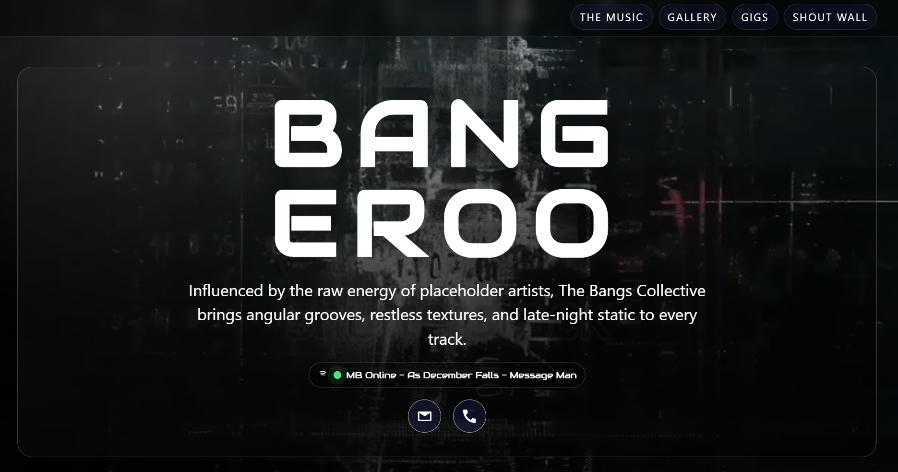

<p align="center">
  
</p>

<h1 align="center">Bangeroo Music Website</h1>

<p align="center">
  <strong>Single-page music showcase</strong> for The Bangs Collective, built with Vite, modular vanilla JavaScript, and Netlify Functions.
</p>

<p align="center">
  <a href="https://bangeroo-music-website.netlify.app">🌐 Live Demo</a> •
  <a href="https://github.com/bangsluke/Bangeroo-Music-Website">💻 GitHub Repository</a> •
  <a href="#key-features">✨ Features</a> •
  <a href="#tech-stack">🛠️ Tech Stack</a> •
  <a href="#architecture-overview">🏗️ Architecture</a> •
  <a href="./SETUP-GUIDE.md">📚 Setup Guide</a>
</p>

<p align="center">
<a href="https://app.netlify.com/projects/bangeroo-music-website/deploys" style="text-decoration: none;">
    
  </a>
  
  
  
  
  
</p>

<p align="center">
  
</p>

## Table of Contents

- [Table of Contents](#table-of-contents)
- [Project Overview](#project-overview)
- [Key Features](#key-features)
- [Tech Stack](#tech-stack)
- [Architecture Overview](#architecture-overview)
- [Quick Start](#quick-start)
- [Development Commands](#development-commands)
- [Testing](#testing)
- [Netlify Deployment](#netlify-deployment)
- [Configuration](#configuration)
- [External Setup](#external-setup)
- [Project Structure](#project-structure)

## Project Overview

Bangeroo is a stylized music website experience centered around The Bangs Collective. It combines rich front-end visuals with lightweight serverless backend integrations for guestbook entries, visitor counting, and Spotify now-playing presence.

The project is optimized for fast static hosting and includes local-first development workflows for both frontend-only and full Netlify Function testing.

## Key Features

- Single-page, section-based layout with responsive header navigation.
- Self-hosted waveform player powered by `wavesurfer.js`.
- Dedicated Spotify embed section plus live now-playing status chip.
- Streaming platform outbound links (Spotify, SoundCloud, Apple Music, Amazon Music).
- Splide-based gallery carousel with mobile and desktop layout behavior.
- Interactive ambience effects (VHS intro, lyric fragments, palette randomizer).
- Shout Wall guestbook backed by Netlify Functions + Supabase.
- Visitor counter backed by Supabase with write-based heartbeat keepalive support.

## Tech Stack

**Frontend**
- Vite
- Vanilla HTML/CSS/JavaScript (ES modules)
- `@splidejs/splide`
- `wavesurfer.js`

**Backend / Integrations**
- Netlify Functions (`netlify/functions`)
- Supabase (`guestbook`, `visitor_count`, `heartbeat_log`)
- Spotify Web API (`spotify-now-playing`)

**Testing**
- Vitest
- jsdom

**Deployment / Observability**
- Netlify static hosting (`dist`)
- Umami analytics script integration

## Architecture Overview

```text
Browser UI (single-page sections + effects)
        |
        +--> Static assets + client modules (Vite build)
        |
        +--> Netlify Functions
               |- guestbook-read / guestbook-write
               |- visitor-count
               |- spotify-now-playing
               |- supabase-heartbeat
                        |
                        +--> Supabase + Spotify APIs
```

## Quick Start

```bash
npm install
npm run dev
```

Then open the local Vite URL shown in your terminal (typically `http://localhost:5173`).

## Development Commands

- `npm run dev` - Frontend-only Vite development server.
- `npm run dev:netlify` - Full local site with Netlify Functions enabled.
- `npm run build` - Production build output to `dist`.
- `npm run preview` - Preview the production build locally.

## Testing

```bash
npm test
```

Also available:
- `npm run test:watch` - Interactive watch mode during development.

## Netlify Deployment

- Build command: `npm run build`
- Publish directory: `dist`
- Functions directory: `netlify/functions`
- Config file: `netlify.toml`
- Redirect in place for health checks: `/api/supabase-heartbeat`

## Configuration

- Site configuration: `src/config/site-config.js`
- Track metadata: `src/config/track-data.js`
- Frontend entry: `src/index.html`
- Environment template: `.env.example`

## External Setup

Use `SETUP-GUIDE.md` for complete setup instructions covering:
- Supabase project/table setup for guestbook and visitor counter
- Spotify app authorization and refresh token flow
- Local verification of Netlify Function endpoints
- Supabase free-tier anti-pause heartbeat automation
- Common troubleshooting steps

## Project Structure

```text
src/
  config/        # Site and track configuration
  css/           # Component and layout styles
  js/            # Feature modules (gallery, guestbook, player, effects)
  index.html     # Main single-page markup
netlify/functions/ # Serverless API handlers
public/            # Static media assets, logos, screenshots
tests/             # Unit/integration tests (Vitest)
```
